### Registro de prompts utilizados para el uso de la Inteligencia artificial.  

Durante el desarrollo de la página web se utilizaron varias aplicaciones de inteligencia artificial para recibir asistencia, adquirir nuevo conocimiento aprendiendo nueva lógica y manipulación de eventos, además para corregir inconsistencias en cuanto al diseño en CSS e interactividad dentro de la lógica definida en JavaScript.  

Las respuestas recibidas por parte de la inteligencia atrificial fueron analizadas y adaptadas en cuanto a la necesidad de mejora para el proyecto y permitieron una mejor comprensión para el desarrollo óptimo de su apariencia y funcionalidad.  

## Prompt:

Cómo puedo ubicar una imagen descargada con fondo blanco como logo dentro del header sin que ocupe todo el espacio:  

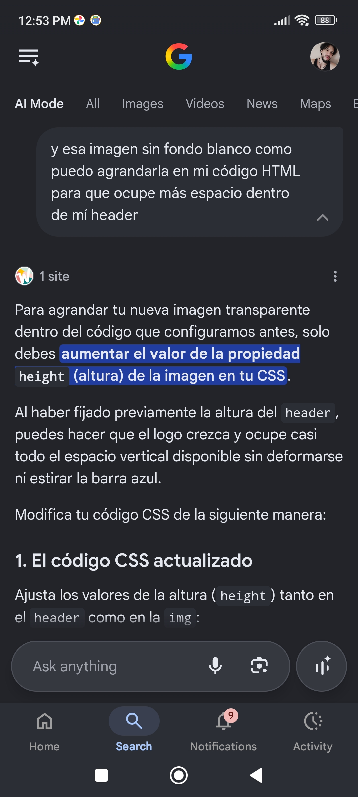
  

Gracias a este mensaje de respuesta se pudo comprender de mejor manera como insertar una imagen de fondo blanco que serviria como logo para insertarla en el header de la página.  

## Prompt:  

Cómo quitar el subrayado de enlace en las palabras de la lista que se encuentran dentro de la barra de navegación.  

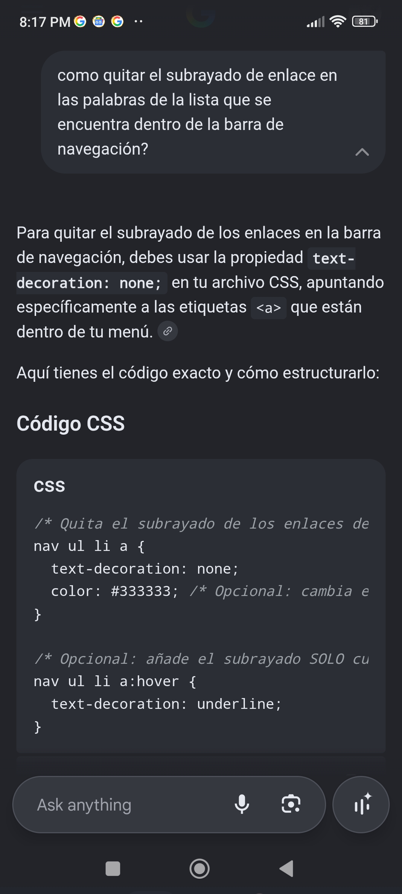
<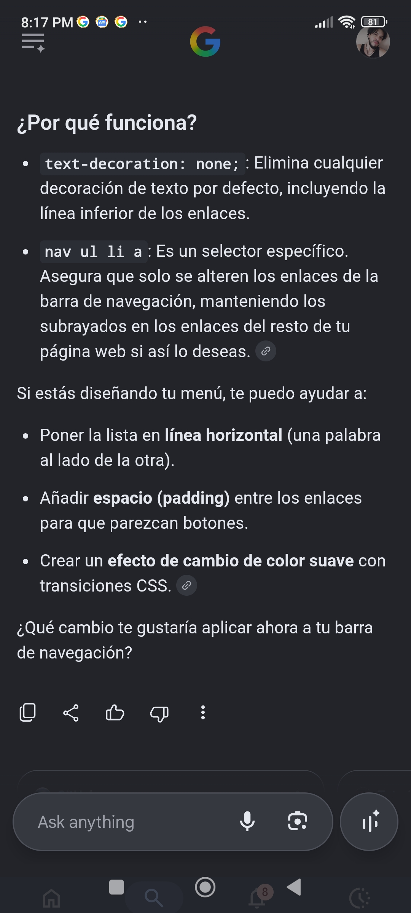  

  

La respuesta de la inteligencia artificial especificó que variable en CSS pudo ayudar para solucionar ese problema y quitar el subrayado a los enlaces internos para que no alteren el diseño de la barra de navegación.  

## Prompt:  

Cómo agregar un hover que genere un recuadro que resalte con una sombra al item de la lista dentro de mi barra de navegación.  

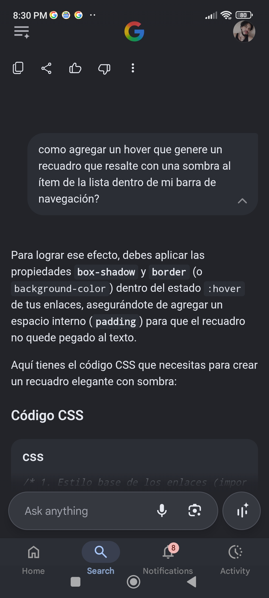
  

La respuesta de la inteligencia artificial ayudó a implementar un nuevo estilo de animación en hover para que la barra de navegación sea mas interactiva.  

## Prompt:  

Estoy creando una función en JavaScript para generar colores hexadecimales aleatorios. Me puedes ayudar únicamente diciendo cuántos números hexadecimales posibles existen para agregar ese dato a mi función.  

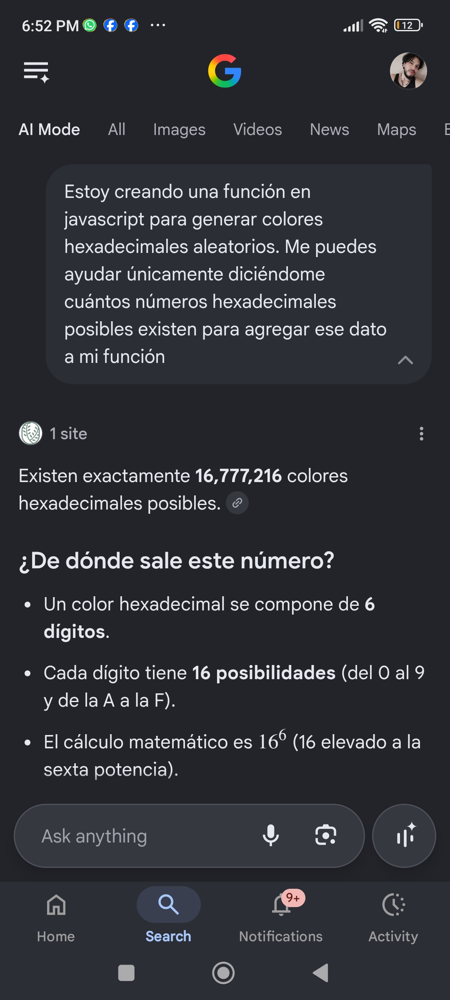
  

Gracias a la respuesta de JavaScript se pudo obtener la cantidad existente total de los números hexadecimales, lo cual permitiría aplicar la función de Math.random en JavaScript para posteriormente generar colores aleatorios en formato HEX.  

## Prompt:  

Cómo puedo hacer que existan unos cuantos colores al abrir la página web y que no aparezcan vacíos hasta que se le da clic a "generar paleta"?  

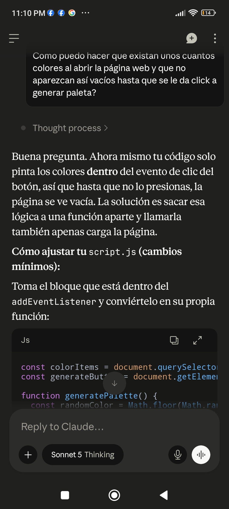
  

Su respuesta pudo ayudar a solucionar un bug que al abrir la página el contenedor de la paleta estaba vacío pero al dar clic al botón de "generar paleta" recién aparecían los colores. Esto se modificó con la finalidad de que el usuario pueda ver la paleta de colores al momento de abrir la página.  

## Prompt:  

Cómo puedo implementar interactividad en el menú selector de colores, teniendo en cuenta que existen 9 colores predeterminados pero al momento de seleccionar se deben reducir a 8 y 6 colores sin romper el diseño y lógica ya establecida para generar los colores aleatorios.

    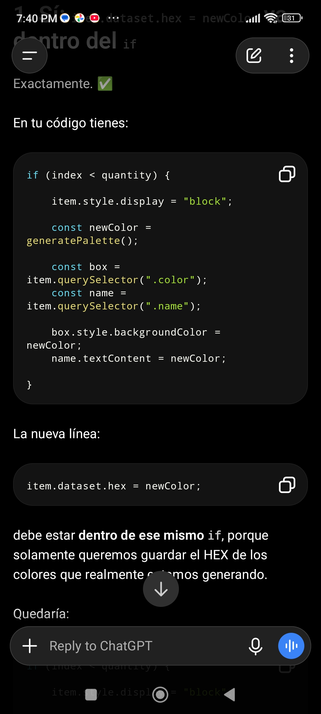
    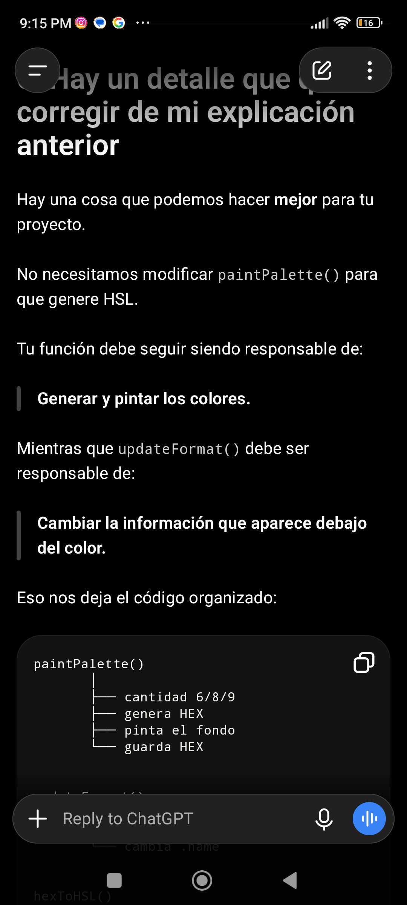

  

La respuesta de la inteligencia artificial pudo ayudar a comprender como disminuir el número de colores existente, es decir de 9 colores a 8 o 6 dependiendo de la selección del usuario.  
Esto debido a que en HTML se dió la estructura inicial para que el comtenedor de paletas tenga 9 colores.  

## Prompt:  

Quiero saber si hay una manera de refactorizar esa lógica para que no se vea tanto código. Sino más bien que en un solo formatOptions se puedan cumplir ambas funciones.  

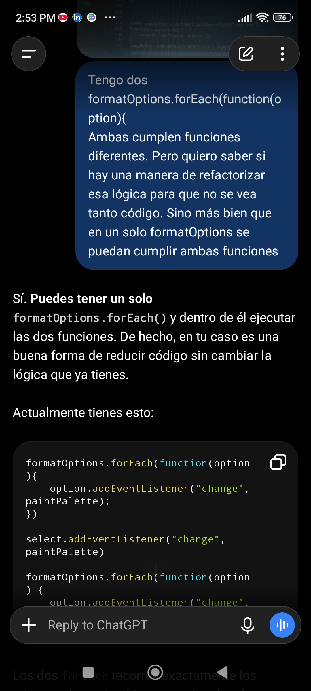
  

Esta respuesta ayudó a encontrar una manera de refactorizar la lógica usada en una sola función para evitar que se amontone tanto código que cumplen las mismas funciones dentro del archivo de JavaScript.

## Prompt:  

Cómo evitar que se genere otra paleta de colores al momento de cambiar de formato, ya que lo que busco dentro de la función al momento de cambiar a otro formato los colores se mantengan y puedan brindar al usuario la informacion de los mismos colores.  

    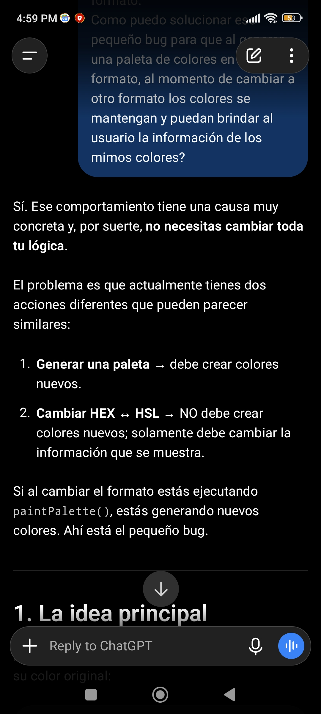
    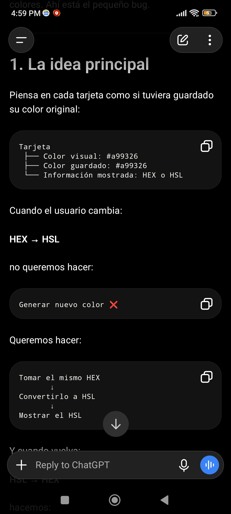
    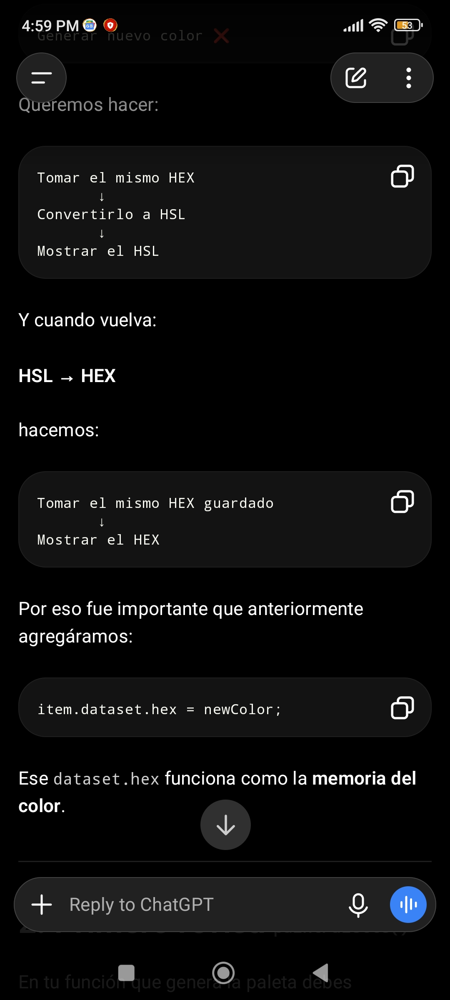
    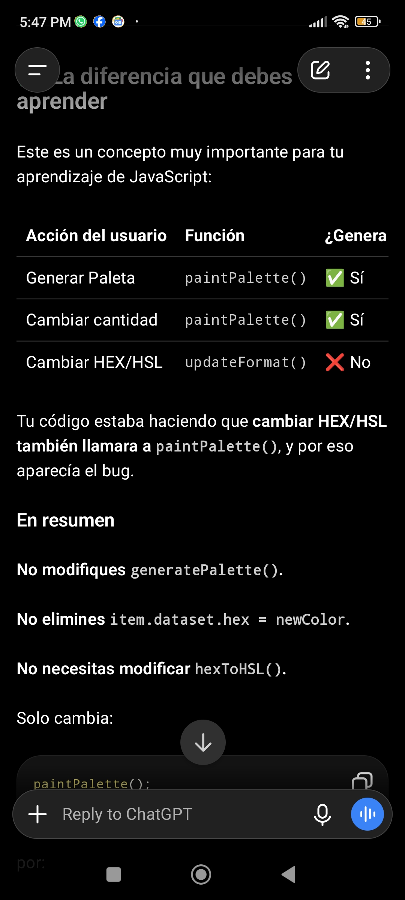

  

La respuesta a esta consulta pudo permitir que la paleta de colores sea la misma cuando el usuario pase del formato HEX a HSL y no se genere una nueva paleta aleatoria al momento de cambiar de formato.  
Esto permite mejor interactividad y que el usuario no pierda los colores generados y pueda obtener su información en ambos formatos.  

## Prompt:  

Pedí a la Inteligencia Artificial que me ayude con un punto de partida para poder guardar los colores generados en la paleta ya que carecía de la información necesaria para poder definir una función que me ayudara a cumplir con este objetivo. 

    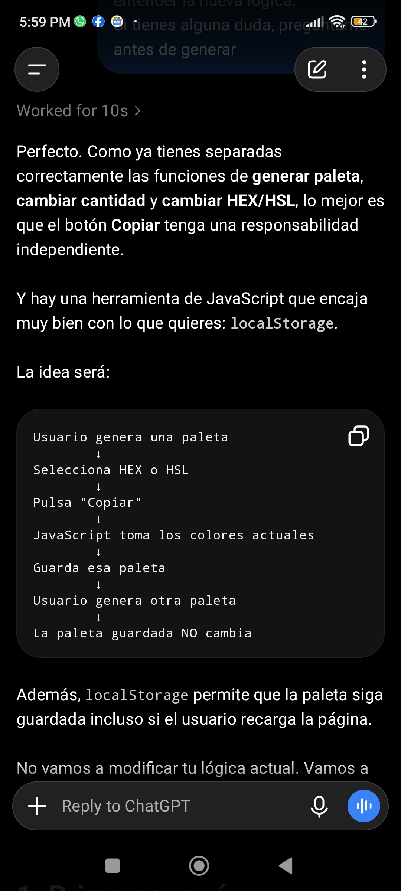
    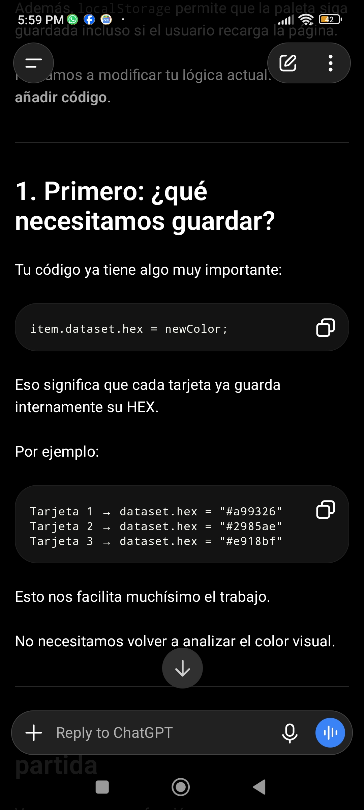
    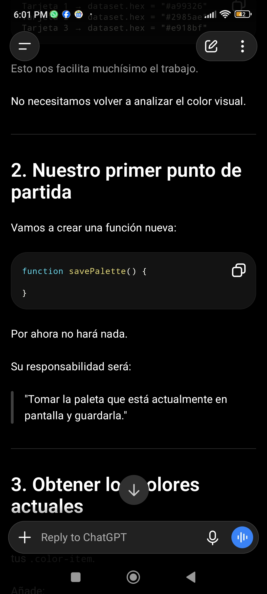
    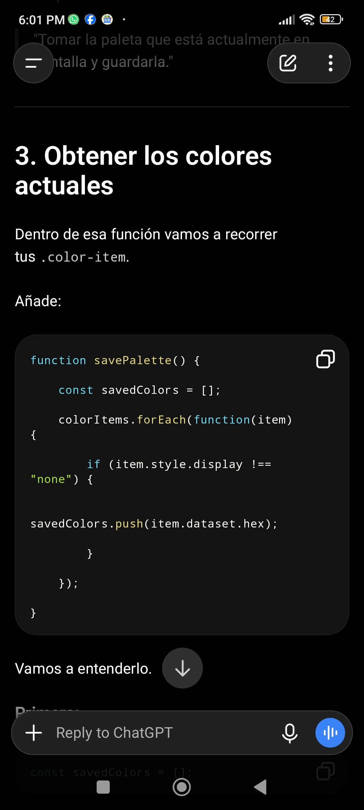
    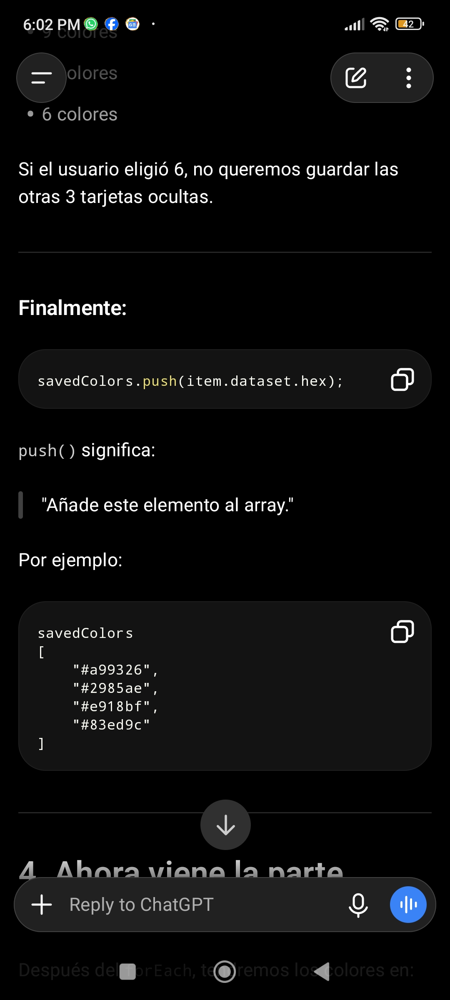
    
    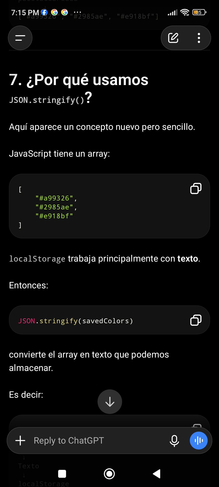
    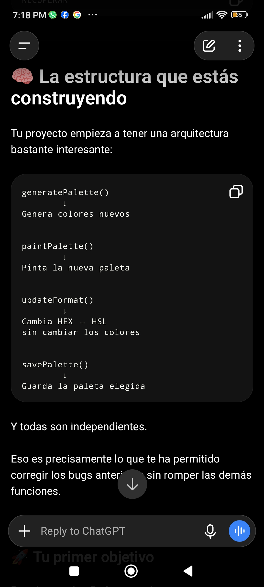
    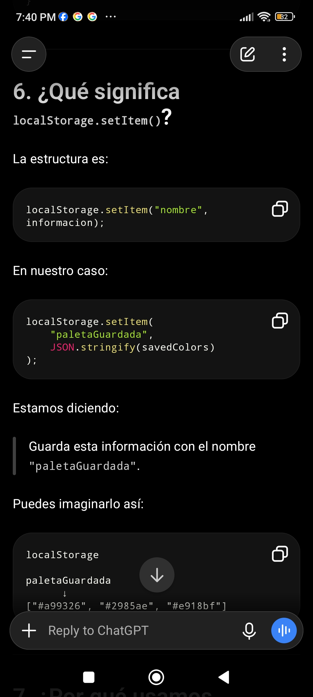

  

La respuesta de la inteligencia artificial  ayudó a comprender que más que una herramienta de trabajo, se convirtió en un asistente de aprendizaje que pudo ayudar paso a paso explicándo en terminos simples como usar local storage sin necesidad de romper ni modificar nada del código actual.  
Gracias a esto se puede comprobar en consola un conjunto de arrays que contienen los colores guardados de la paleta generada especificando su información y el formato HEX o HSL previamente seleccionado.  

## Prompt:  

Ahora quiero que el usuario tenga un pequeño mensaje o feedback donde se muestre que obtuvo el color copiado.  Cómo puedo realizar esa acción; Cúal sería mi punto de partida dentro de mi archivo actual?

    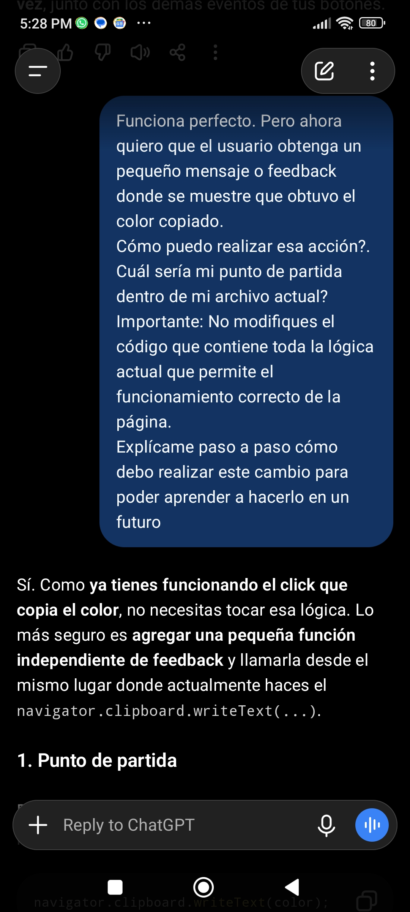
    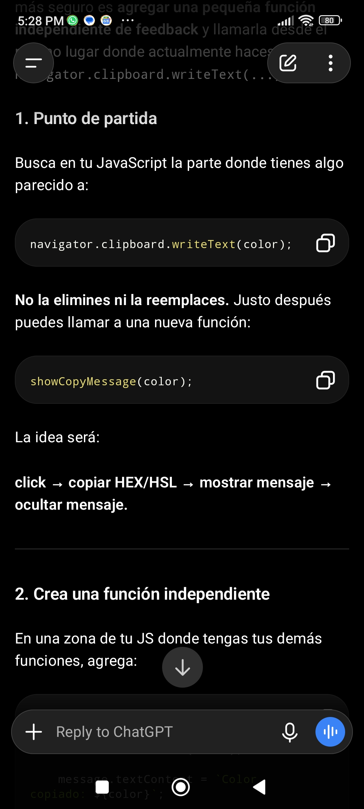
    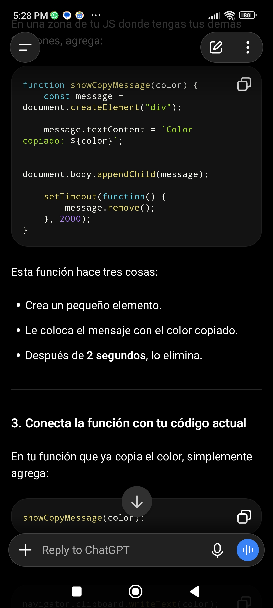

  

Gracias a esta respuesta se pudo entender las bases para poder crear un mensaje que pueda ver el usuario al momento de realizar una acción, en este caso sobre el color que copió dentro de la paleta.  
Esto permitió entender que también se usa un classList.add para que también se le pueda dar un estilo en CSS al contenedor del mensaje que el usuario puede ver en pantalla confirmando su acción en el navegador.

